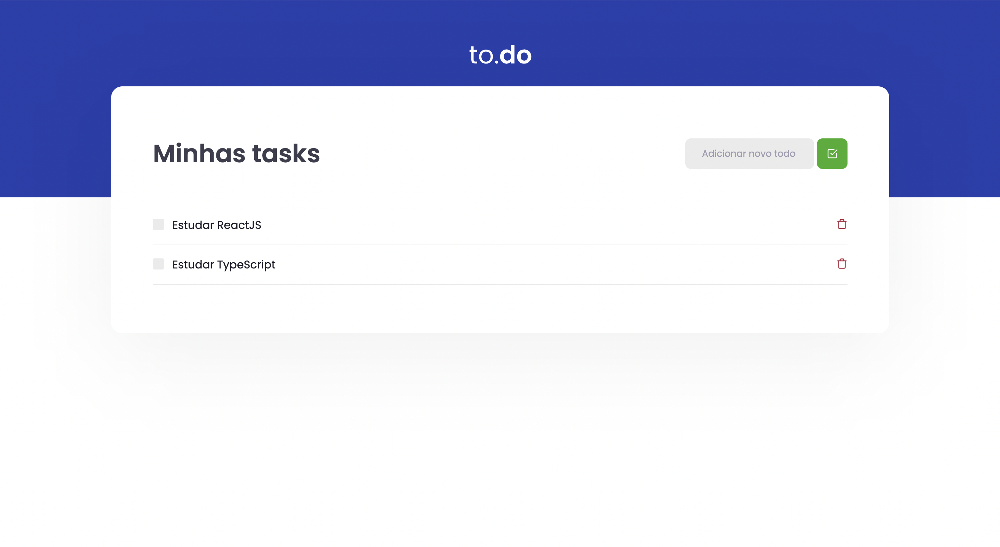
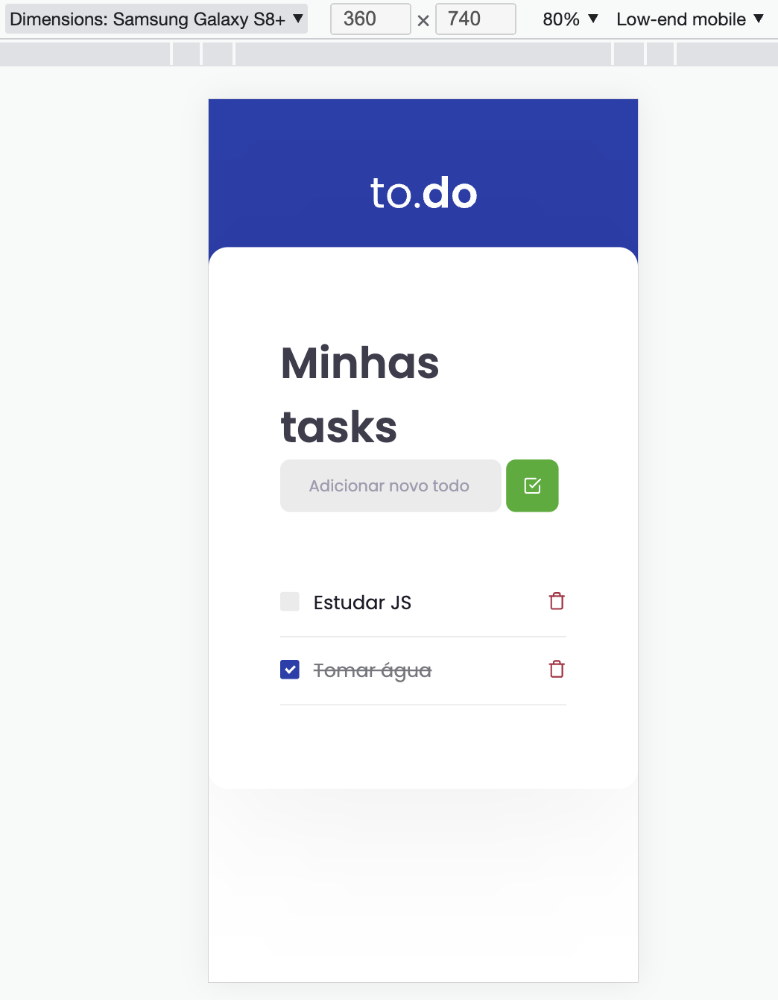

# Desafio 01 - Conceitos do React 

Neste desafio foi criado uma aplicação onde o principal objetivo é uma pequena aplicação de atividades a fazer, para treinar um pouco mais sobre manipulação do estado no React.

- Adicionar uma nova tarefa
- Remover uma tarefa 
- Marcar e desmarcar uma tarefa como concluída

Foi criado as funcionalidades para as três funções presentes nesse arquivo, que são:

- **handleCreateNewTask**: Deve ser possível adicionar uma nova task no estado de `tasks`, com os campos `id` que deve ser gerado de forma aleatória, `title` que deve ser um texto e `isComplete` que deve iniciar como false.
- **handleToggleTaskCompletion:** Deve alterar o status de `isComplete` para uma task com um ID específico que é recebido por parâmetro.
- **handleRemoveTask:** Deve receber um ID por parâmetro e remover a task que contém esse ID do estado.

## Tecnologias 💻

HTML |
SCSS |
REACTJS |
TYPESCRIPT 

## Layout Mobile e Desktop 

      
      

